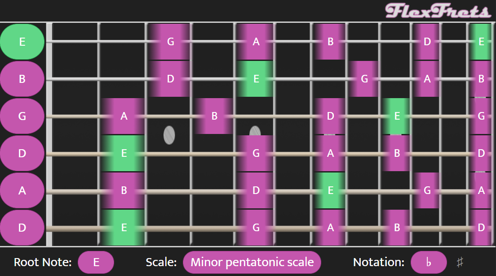
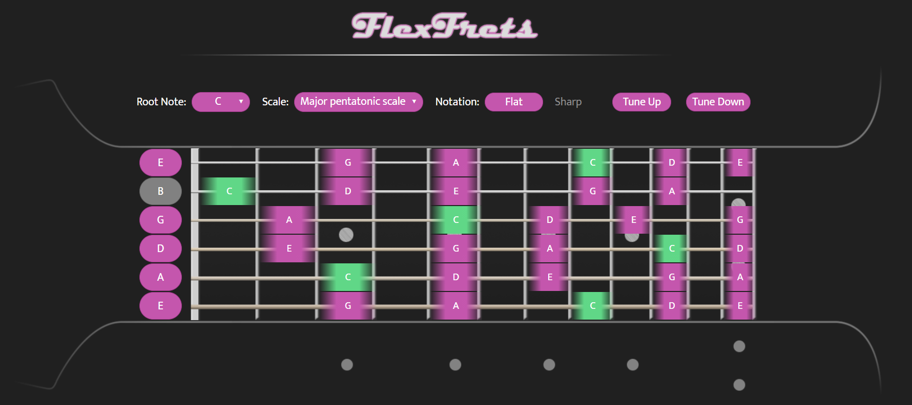

# FlexFrets

## Overview

FlexFrets is a single-page AngularJS Web application that provides a visual representation of what different scales and modes look like on a guitar fretboard. The main goal of this project was to create something flexible that could accommodate non-traditional guitar tunings.

The application was created with a mobile-first design. It is fully responsive and will work on any size device.

**Mobile**

**Desktop**

[Click here to see the project in action](https://tommyduggs.github.io/flexfrets)

## How Does It Work?

To fully understand the purpose of this app, some knowledge of music theory is required. The important thing to know is that scales and modes are essentially just a set of notes. The root note defines the starting point on which the scale or mode is built.

The notes on the far left of the fretboard represent the notes the guitar strings are tuned to. You can change the tuning by clicking the note and selecting a new note from the list. You can then choose a scale to view by selecting a root note then a scale name from the dropdowns.

## Documentation

The JavaScript files in this project are annotated using JSDoc notation. This allows us to automatically generate documentation that describes the functionality of the scripts. JSDoc was mainly added to this project to serve as a proof of concept. Though perhaps unnecessary for a project of this size, the ability to automatically generate detailed documentation would be very helpful when building something such as a large-scale API.
[Click here to view the documentation generated](https://tommyduggs.github.io/flexfrets/documentation/).

You can generate this documentation locally by running `npm install` in the project directory. Once the packages have been installed you can regenerate the documentation by running `npm run docs`

*Note: JSDoc is currently not working with node version 14*

## Running Locally

All of the files required to run the web application are included with the project. You can view the application locally by opening the index.html file.

## License

Distributed under the MIT License. See `LICENSE` for more information.
